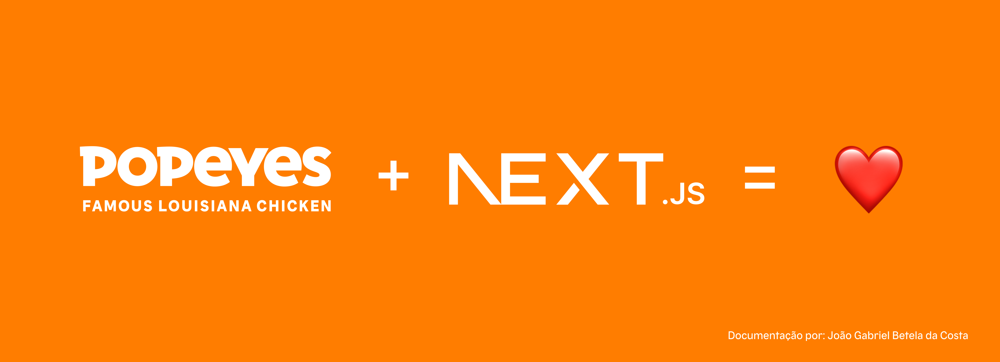

# 🍗 Popeyes Brasil - Website [Next.JS]

Este projeto é uma aplicação web full-stack desenvolvida com [Next.js](https://nextjs.org/) para modernizar o site da Popeyes Brasil. A transição para Next.js permite melhorar o desempenho, renderização no lado do servidor e a experiência do usuário.


## Visão Geral

A Popeyes escolheu o Next.js como o framework principal para construir sua plataforma web, aproveitando recursos como renderização no lado do servidor, roteamento dinâmico e integração com APIs. Ao combinar o poder do Next.js com frameworks CSS modernos como o Tailwind CSS, o site atinge alto desempenho e uma base de código escalável.

A aplicação integra serviços de backend para fornecer dados em tempo real sobre locais de restaurantes, promoções e muito mais.

Você pode acessar a [documentação completa do projeto no confluence clicando aqui](https://burgerking.atlassian.net/wiki/spaces/PLK/pages/1729003527/Novo+site+NextJS+Documenta+o+site+PLK)

## Funcionalidades

- **Next.js (App Router)** para renderização no lado do servidor e otimização de páginas.
- **Tailwind CSS** para design responsivo e baseado em utilitários.
- **Validação de dados** usando **Zod**.
- **GA4** integrado para o Google Analytics.
- Geração de sites estáticos (SSG) e renderização de conteúdo dinâmico.
- Filtragem de localizações em tempo real para disponibilidade de restaurantes.
- Gerenciamento de formulários com **react-hook-form**.
- Autenticação de número de celular usando validação com Zod.

## 🛠️ Instalação

Clone o repositório e instale as dependências:

```bash
git clone https://bkbrasil@dev.azure.com/bkbrasil/plk-site/_git/plk-site-next
cd plk-site-next
npm install
```
## 🚀 Executando o Projeto
Para executar o projeto localmente utilize:
```bash
npm run dev
```

Para executar o projeto localmente com as variáveis de ambiente de produção utilize:
```bash
npm run dev:prod-env
```

Para executar o projeto localmente com build estática gerada anteriormente com o comando ```npm run build``` utilize:
```bash
npm run static
```
***Atenção:*** Para que o comando acima funcione você precisa gerar uma build do projeto no modo estático, [veja como fazer isso clicando aqui](https://nextjs.org/docs/pages/building-your-application/deploying/static-exports)

A aplicação estará disponível em http://localhost:3000.


## ⚒️ Compilando o projeto para produção

Para compilar o projeto para produção, você pode escolher por duas opções:

 - Compilar o projeto com as variáveis ambiente de <b>PRODUÇÃO</b>
 - Compilar o projeto com as variáveis ambiente de <b>DESENVOLVIMENTO</b>

Para compilar o projeto com as variáveis de ambiente de <b>PRODUÇÃO</b>, utilize o seguinte comando:

```bash
npm run build:prod
```

Para compilar o projeto com as variáveis de ambiente de <b>DESENVOLVIMENTO</b>, utilize o seguinte comando:

```bash
npm run build:dev
```

Por padrão, ao executar o comando ```npm run build``` sem a flag ```:dev``` ou ```:prod``` o projeto sempre compilará o projeto com as variáveis de ambiente de produção.

</> Projeto desenvolvido por [João Gabriel Betela da Costa](https://www.linkedin.com/in/jo%C3%A3o-gabriel-betela-da-costa/)

✍🏼 Design/UI/UX por [Marcos Razuk](https://www.linkedin.com/in/marcosrazuk?miniProfileUrn=urn%3Ali%3Afs_miniProfile%3AACoAAAJ_RaABAYVft-GXpeMUPWgtflv79Ti_NqQ&lipi=urn%3Ali%3Apage%3Ad_flagship3_search_srp_all%3B2KqIr%2F0NQ1Gw7m0HE%2Bt8%2Fg%3D%3D), [Camila Mesquita](mailto:camila.mesquita@zamp.com.br)


© 2024 POPEYES®. Todos os direitos reservados.